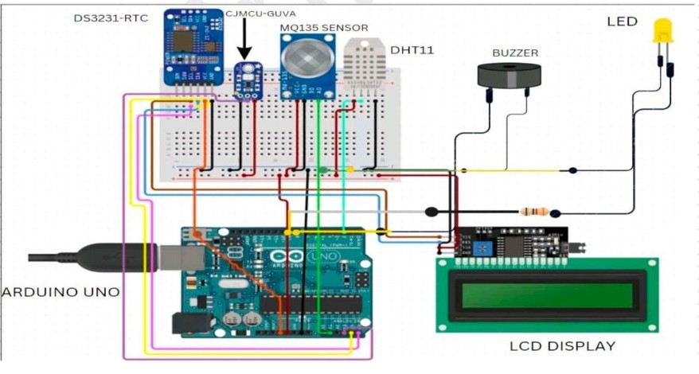

# WeatherTech - IoT Weather Monitoring System

## Overview
WeatherTech is a compact Arduino-based environmental monitoring system that measures temperature, humidity, air quality, and UV index. The system integrates multiple sensors and displays real-time data on an LCD screen.

## Features
- Temperature and humidity monitoring
- Air Quality Index detection
- UV radiation measurement
- Real-time clock display
- LCD output
- Air quality alert using buzzer
- Data logging capability

## Hardware Components
- Arduino Uno
- DHT11 Sensor
- MQ135 Gas Sensor
- CJMCU-GUVA-S12SD UV Sensor
- DS3231 RTC Module
- 16x2 LCD with I2C
- Buzzer
- LED

## Technologies Used
- Arduino IDE
- C++ Programming
- I2C Communication
- Sensor Libraries

## Circuit Diagram

## Working

## System Architecture
Sensors collect environmental data → Arduino processes the data → Information is displayed on LCD → Alerts triggered when thresholds exceed.

## Future Enhancements
- Add more sensors
- Mobile app integration
- Smart home connectivity
- Machine learning based prediction
- Power saving sleep mode
